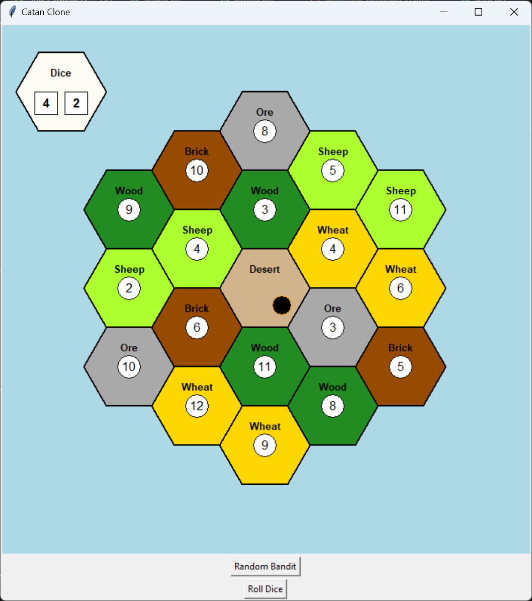

# Catan clone in python
**Author: Emre Acarsoy**, University of Exeter  

This personal project is a recreation in python of the board game Catan (formerly known as Settlers of Catan).  
Catan is a board game where players compete to "settle" an island. Players collect various resources and use them to build roads and villages to earn points.

This project is written in python. The module tkinter was used for the interface. No extra requirements.  

---
## Build

To build, simply run `main.py` in the `src` folder.

---

## Interface 

The 'Roll Dice' button updates the value of the two 6 sided dice in the top left.  
The small black circle is the robber. You can move the robber with your mouse, using drag and drop. Alternatively, the 'Random Bandit' button places the robber at a random location on the board.  
Below is an example of the interface:  

---

# TODO

### Board elements

- [x] implement board
    - [x] draw hexagons
    - [x] specify resource types
    - [x] specify hexagon values
- [x] implement "robber"
    - [x] drag and drop functionality
    - [x] move to random position (useful?)
- [x] add dice roll
    - [x] functionality
    - [x] display
- [ ] add ports
    - [ ] draw ports at specific locations
    - [ ] display type of port
- [ ] implement roads
- [ ] implement settlements
    - [ ] villages
    - [ ] upgrading to cities
  
### Player elements

- [ ] implement inventory
- [ ] add resources per turn
- [ ] player profiles
    - [ ] turn order
    - [ ] trading cards
    - [ ] stealing cards
  - [ ] display inventories
- [ ] port trading
- [ ] points scoring
  - [ ] normal
  - [ ] longest road
  - [ ] strongest army
  - [ ] win detection

---

## Acknowledgments
- Based upon CATAN, a creation and design of Klaus Teuber and property of CATAN GmbH.
- Copyright © 2017 (or later date) CATAN Studio, Inc. and CATAN GmbH. All rights reserved.
- All trademarks contained herein are the property of CATAN GmbH. All rights reserved.

This is a personal project. Commercial use is not allowed.

